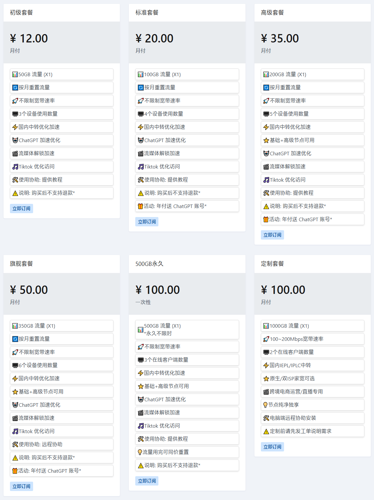

# nicecloud耐思云官网最新地址

耐思云永久官网：[https://nicecloud.io](https://init.innice.org/#/register?code=ocpiCtPe)

官网打不开怎么办？下面是最新备用地址：

耐思云直连地址一：[init.innice.org](https://init.innice.org/#/register?code=ocpiCtPe)

地址二：[https://nicepro.cc](https://nicepro.cc/#/register?code=ocpiCtPe)

---

**温馨提示：任何服务均有跑路风险，请自行注意防范！**

**本页面仅分享网络信息，不做推荐，有问题请自行联系服务商处理！**

---

## 耐思云nicecloud简介

NiceCloud 耐思云，老牌、便宜、稳定SS/SSR加速器，节点涵盖美国，香港，台湾，日本，韩国，新加坡，马来西亚等，支持ChatGPT与Tiktok、Netflix、Disney等流媒体视频解锁，性价比不错。

### 耐思云nicecloud特点

*   流量充足，定价偏低，属于便宜低价梯子；
*   入口数量多，常用热门节点香港日本等均单独配置入口，稳定性高；
*   支持主流 App 如 Shadowrocket/Clash/Stash 等订阅节点；
*   全套餐都提供ChatGPT、TikTok、流媒体解锁；

## 耐思云套餐价格

耐思云套餐定价灵活，月付低至￥12/月，能够满足绝大部分的应用落地与不同的用户需求，另外针对轻量翻墙用户提供不限时永久有效流量包。

## 耐思云怎么样？

总的来说，耐思云稳定好用，梯子节点价格便宜。并且NiceCloud梯子套餐灵活，可提供永久有效流量套餐，基本覆盖大部分用户的不同外网加速需求。

如果你在找高性价比梯子，不妨选择NiceCloud耐思云试试。

---

**温馨提示：任何服务均有跑路风险，请自行注意防范！**

**本页面仅分享网络信息，不做推荐，有问题请自行联系服务商处理！**

---
